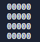

# Contributing 🤚

If you want to contribute to **Oz-Engine** to :
* Fix a **bug**
* Improve **performance**
* Add useful **features** 
* Add **enhancements**

then making a pull request is the best solution !

## Adding / Changing a feature 

When you add or change please describe prescilly what you did it
and how it works so I can understand it.

## Reporting a **bug** 🪲

When reporting a bug please be clear in what isn't working when the following action are performed, if you know why this occurs
then try explaining it 🗣️, it will help others understand what should be exactly fixed.


# How the **Engine** works 🌟

To start simple imagine we have a board that is filled with "0"



this board can be represented with a 2D-list:
```python
[  
   [0, 0 , 0 , 0, 0],
   [0, 0 , 0 , 0, 0],
   [0, 0 , 0 , 0, 0],
   [0, 0 , 0 , 0, 0],
                       ]
```

and that what the method "clear_canvas" from the "Camera" class makes for you:

``` python
def clear_canvas(self):
    """
    returns a clean canvas, setted
    in to it's empty state
    """

    SIZE_X = self.size[0]
    SIZE_Y = self.size[1]

    line = [self.canvas_owner.void for _ in range(SIZE_X)] #creates a list containing the 
                                                           #argument "void" 
                                                           #it would give : '[ 0 , 0 , 0 , 0 , 0]'  if SIZE_X = 5 and void = 0)

    clear_canvas = [line.copy() for _ in range(SIZE_Y)]    #appends multiple  copies(so we can edit it) of line 
    return clear_canvas                                    #the amount of copies appended depends on the value "SIZE_Y"
    #and we return "clear_canvas".
```

and we should get what we had at first using this function.

## Editing the canvas

Let's bring some life to this empty canvas by using the method "edit_element"

```python

  def edit_element(self, canvas, x, y, char):
    """
    allows to edit an element of a canvas
    """
    # "canvas" is the canvas we want to edit (you'l see later that we always the same one)
    # "y" is the line we want to edit
    # "x" is the element in the line want to edit.
    # and "char" is the character that we replace by the old one.

    (canvas[y])[x] = char 

```

# Classes 

There are 3 Classes In Oz-Engine :

⬤ **Canvas**

⬤ **Sprite**

⬤ **Camera**

## Canvas

Canvas object can be used to store sprite informations
It has one parameter "void" which what empty cells look like.

Here is an example :
```python

canvas_fruit = oz.Canvas("o") # "void" here is "o"

apple = oz.Sprite(canvas_fruit , "🍎" , [0 , 0] , "apple")
banana = oz.Sprite(canvas_fruit , "🍌" , [1 , 0] , "banana")


canvas_vehicles = oz.Canvas("#")

car = oz.Sprite(canvas_fruit , "🚗" , [0 , 0] , "car")
plane = oz.Sprite(canvas_fruit , "✈" , [1 , 0] , "plane")
```

Here "canvas_fruit" does only contain information about "apple" and "banana"
And "canvas_vehicles" contain information about "copybook" and "notebook"


# Methods

## \_\_init\_\_

Nothing particular here just setting up
the given parameters and instantiating variable that are needed.

```python
 def __init__(self, void):
    ''' Characters that fills the canvas when nothing is rendered on a tile. '''
    self.void = void
    '''List that contains every distance of each sprite '''
    self.distance_tree = []
    '''List that contains every reference of each sprite '''
    self.sprite_tree = []
    '''List that contains every groups that exists'''
    self.group_tree = []
    '''List that contains every name of each sprite '''
    self.sprite_names = []
    '''Dictionary that has a sprite reference as a key and the corresponding name as a value'''
    self.sprite_name_dict = {}
    '''Dictionary that has a sprite reference as a key and the corresponding position as a value'''
    self.sprite_position_dict = {}
    '''Dictionary that has a sprite reference as a key and the corresponding group as a value'''
    self.sprite_group_dict = {}
```


## get_sprite

The method "get_sprite" allows to get the reference of sprite by it's name.
It works with a dictionnary that stores names as keys a reference as values.

```python
  def get_sprite(self, name):
    """
    returns reference to sprite that owns the given name
    """

    return self.sprite_name_dict[name]
```

## call_group 📢

Allows you to call a "method" to a group
```python
  def call_group(self, group_to_call: str, method_to_call, *args):
    """
    Call a method  to every sprites that belongs to the group that is
    given 

    like so:

    canvas.call_group("group_name_here" , method_is_going_to_be_called_on_them() )
    
    """

    #gets every sprite that is in the group given
    
    sprite_to_call = self.sprite_group_dict.get(group_to_call)
    if sprite_to_call == None:
      #if group given doesn't exist then sumbit error
      raise Exception(
        f'''The group "{group_to_call}" doesn't exist please specify a valid group to call. '''
      )

    for todo_sprite in sprite_to_call:

      #get function of sprite
      func = getattr(todo_sprite, method_to_call)
      #executes it with the argument given
      func(*args)
```

"sprite_group_dict" is dictionnary that holds every sprite reference that is in the given group.

# Sprite 🍄

Sprite objects are used to fill the canvas
they have 5 parameters :

⬤ **canvas_owner**

⬤ **char**

⬤ **position**

⬤ **name**

⬤ **group**


# Methods

## \_\_init\_\_

Here we just set up the variable that were asked in the parameters


```python

 def __init__(
    self,
    canvas_owner: object,
    char: str,
    position: list,
    name: str,
    group=None,
  ):
    '''Character that represents the sprite when rendered.'''
    self.char = char
    '''List that has two element "x" and "y" it tells where to render the sprite.'''
    self.position = position
    '''Name of the sprite that can be used to get reference from it using the "get_sprite" method throught a "Canvas" object.'''
    self.name = name
    '''Canvas that the sprite is associated to.'''
    self.canvas_owner = canvas_owner
    '''group is a string that be used to call a method on each sprite that has the same method with 
    the method "call_group" through the canvas and it can also be used to check collision by seing which sprite of which
    group is colliding with our sprite with the method "get_colliding_groups" that can be executed by a "Sprite" object. '''
    self.group = group

```

and here we register info to the __canvas_owner__.


```python
    
    if name in canvas_owner.sprite_names:
      # change name if already taken
      self.name = name + f"@{str(id(self))}"

    # register infos in "canvas_owner" :
    canvas_owner.sprite_tree.append(self) # register reference
    canvas_owner.sprite_names.append(self.name) # register name
    canvas_owner.sprite_name_dict[self.name] = self # register name as key and reference as value 
    canvas_owner.sprite_position_dict[self] = position # register reference as key and position as value
    
    if not (group in canvas_owner.sprite_group_dict):
      #if group is new then add to "group_tree" and create new key
      #location for "sprite_group_dict".
      canvas_owner.sprite_group_dict[group] = []
      canvas_owner.group_tree.append(group)

    canvas_owner.sprite_group_dict[group].append(self) #add group reference to the group dict
    #it can looks something like that : { "group" : [sprite_reference1 , sprite_reference2 , ect] }

```

## destroy 💣

__destroy__ is used to delete sprite
it just deletes things that we registered earlier in the __\_\_init\_\___

```python
  def destroy(self):

    del self.canvas_owner.sprite_name_dict[self.name]
    del self.canvas_owner.sprite_position_dict[self]

    #remove self from key that contain every sprite in group
    INDEX = self.canvas_owner.sprite_group_dict[self.group].index(self)
    del (self.canvas_owner.sprite_group_dict[self.group])[INDEX]

    self.canvas_owner.sprite_names.remove(self.name)
    self.canvas_owner.sprite_tree.remove(self)

    if len(self.canvas_owner.sprite_group_dict[self.group]) == 0:
      #delete group if no one is in it.
      del self.canvas_owner.sprite_group_dict[self.group]
      self.canvas_owner.group_tree.remove(self.group)

    del self
```

## rename

__rename__ as it name suggest allows to rename sprites
it changes every time the __old__ name was used by the __new__ one given.
```python
 def rename(self, new_name: str):
    """
    allows to change the name of a sprite, to "rename" it.
    """

    del self.canvas_owner.sprite_name_dict[self.name]

    if new_name in self.canvas_owner.sprite_names:
      # change new_name with object id() if name already taken
      new_name = new_name + f"@{str(id(self))}"

    # change name

    INDEX = self.canvas_owner.sprite_names.index(self.name)
    self.canvas_owner.sprite_names[INDEX] = new_name
    self.name = new_name
    self.canvas_owner.sprite_name_dict[new_name] = self
```

## get_colliding_objects 💥

__get_colliding_object__ works by getting the reference of each sprite that is located at the
same __position__ of the sprite that calls the method.

```python
  def get_colliding_objects(self):
    """
    Returns a list of colliding objects(by name)
    """

    object_colliding = [] 

    sprite_check_list = list(
      self.canvas_owner.sprite_position_dict.copy().keys())
    position_check_list = list(
      self.canvas_owner.sprite_position_dict.copy().values())

    sprite_check_list.remove(self)           #remove self reference
    position_check_list.remove(self.position) #remove self position

    for todo_sprite in sprite_check_list:

      POSITION_CHECK = self.canvas_owner.sprite_position_dict[
        todo_sprite]  # gets the position from key

      if self.position in position_check_list: #checks until the no sprites has the same position

        object_colliding.append(
          todo_sprite.name) if POSITION_CHECK == self.position else None
      else:
        break

    return object_colliding
```

It gives back names of the sprite who are colliding with us.

## get_colliding_groups 💥

It works the same as __get_colliding_objects__ except here it gives the group instead of giving back names.
We check if all groups are in __groups_colliding__.

```python
 def get_colliding_groups(self):
    """
    Returns a list of colliding objects(by groups)
    """

    groups_colliding = []

    sprite_check_list = list(
      self.canvas_owner.sprite_position_dict.copy().keys())
    position_check_list = list(
      self.canvas_owner.sprite_position_dict.copy().values())

    sprite_check_list.remove(self)
    position_check_list.remove(self.position)

    for todo_sprite in sprite_check_list:

      POSITION_CHECK = self.canvas_owner.sprite_position_dict[
        todo_sprite]  # gets the position from key

      if self.position in position_check_list and not (set(
          self.canvas_owner.group_tree) == set(groups_colliding)):

        groups_colliding.append(
          todo_sprite.group) if POSITION_CHECK == self.position else None
      else:
        break

    return groups_colliding

```

## update_layer

__update_layer__ is used to well update distance of your sprite
it's used in every __moving__ / __position__ functions
```python
  def update_layer(self):
    """

        update the dictionary : "sprite_position_dict" of "canvas_owner"
        like so :

        sprite_reference :  sprite_position

        """

    # update it
    self.canvas_owner.sprite_position_dict[self] = self.position
```

## position-based methods

I'm not cover how every position-based method works because they are very similar to each other
but here how one of then works:

```python
  def change_position(self, x_val: int = 0, y_val: int = 0):

    self.position[0] += x_val
    self.position[1] += y_val
    self.update_layer()
```

# Camera 🎥

__Camera__ object is used to render __Canvas__ object
it has 4 parameters:

⬤ **canvas_owner**

⬤ **size**

⬤ **position**

⬤ **name**


## \_\_init\_\_

Nothing particular here just setting up variables

```python
def __init__(self, canvas_owner: object, size: list, position: list,
               name: str):
    '''canvas that is associated with. '''
    self.canvas_owner = canvas_owner
    '''size of the camera '''
    self.size = size
    ''' position of the camera '''
    self.position = position
    ''' name of the camera'''
    self.name = name
    ''' define the order of rending sprties '''
    self.sprite_render_priority = []
    ''' dictionnary that contain keys "sprite" for value "distance" '''
    self.sprite_distance_dict = {}

    if size == [0, 0]:

      warn(
        f''' size of camera : "{name}" isn't defined so it will most likely not work.\n please define a valid size.'''
      )
```
## update_sprite_distance

This method is used to update all distances of each sprites
```python

  def update_sprite_distance_dict(self):
    """
        update the distance of every sprite
        """

    self.sprite_distance_dict = {} #creates empty dict

    for todo_sprite in self.canvas_owner.sprite_tree: #we interate through every sprite reference
      sprite_position = [                             #and update the distance for each of them
        todo_sprite.position[0] - self.position[0],
        todo_sprite.position[1] - self.position[1]
      ]
      self.sprite_distance_dict[todo_sprite] = self.get_square_distance_to(
        sprite_position)
```


## edit_element

Is used to replace a char by a new one.

```python
  def edit_element(self, canvas, x, y, char):
    """
    allows to edit an element of a canvas
    """

    #canvas[y] gets the line
    # and then with [x] gets the element
    
    (canvas[y])[x] = char
```

## get_square_distance_to

Gives back the sum of the distance of the four corner of the render canvas
```python
  def get_square_distance_to(self, position: list):
    """
    returns the sum of the distance between the 4 corners of the square
    """

    SIZE_X = self.size[0] - 1  
    SIZE_Y = self.size[1] - 1

    corner_top_left = [0, 0]
    corner_top_right = [SIZE_X, 0]
    corner_bottom_right = [SIZE_X, SIZE_Y]
    corner_bottom_left = [0, SIZE_Y]

    return (math.dist(corner_top_left, position) +
            math.dist(corner_top_right, position) +
            math.dist(corner_bottom_right, position) +
            math.dist(corner_bottom_left, position))
```

## is_renderable

Says whetever a sprite can rendered or not.
```python
  def is_renderable(self, distance):
    """
        returns whether a sprite a renderable from the distance given.
        """

    MAX_DISTANCE = (self.get_square_distance_to([0, 0])) #represents the maximum distance to be rendered

    return not (distance + self.get_square_distance_to(self.position)) > (
      MAX_DISTANCE + self.get_square_distance_to(self.position))
```

## render 

__render__ is the main method of __Camera__ it returns back a string that represents the canvas if the parameter __is_string__ is True else returns a the canvas as a 2D-list
```python
  def render(self, is_string=True):
    """
    Returns the rendered canvas as a string if "is_string" is true else as a          2D-list
    """

    self.update_sprite_distance_dict()
    canvas = self.clear_canvas()

    MAX_DISTANCE = (self.get_square_distance_to([0, 0]))

    distances = list(self.sprite_distance_dict.copy().values())
    sprite_list = list(self.sprite_distance_dict.copy().keys())

    for todo in range(len(self.canvas_owner.sprite_tree)):

      min_distance = min(distances)
      # gets the smallest distance in list "distances"
      is_off_screen = (min_distance + self.get_square_distance_to(
        self.position)) > (MAX_DISTANCE +
                           self.get_square_distance_to(self.position))

      if is_off_screen:
        # if the smallest distance of the sprite(+ camera offset)
        # is bigger than "MAX_DISTANCE"
        break

      #get corresponding sprite reference
      index = distances.index(min_distance)
      sprite = sprite_list[index]
      position_to_render_sprite = [
        sprite.position[0] - self.position[0],
        sprite.position[1] - self.position[1]
      ]

      #edit canvas
      self.edit_element(canvas, position_to_render_sprite[0],
                        position_to_render_sprite[1], sprite.char)

      # remove thoses
      del sprite_list[index]
      del distances[index]

    if is_string == True:

      canvas = ["".join(canvas[line]) for line in range(len(canvas))]

      for element in range(len(canvas) - 1):

        canvas[0] += "\n" + canvas[element + 1]
      canvas = canvas[0]

    return canvas
```
