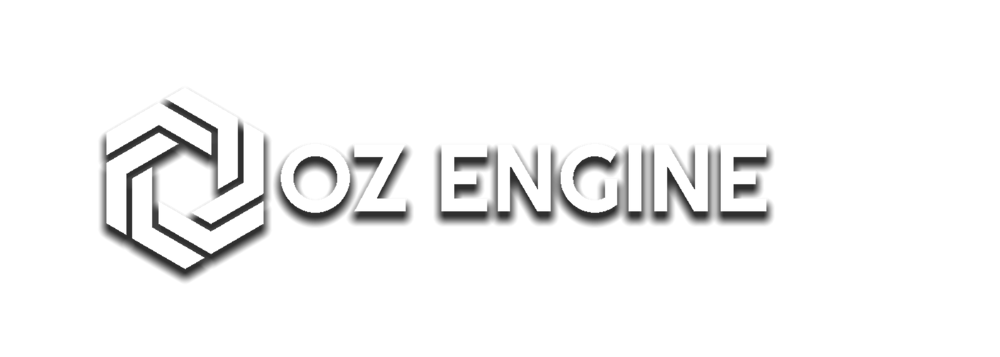

                               



# Oz-Engine, a **Text-Based Game Engine** Made Using **Python**.

**Oz-Engine** is a Engine that allow to control **characters** individually like **sprites** you would have in a classic game engine.
It can be used to make games in:
* **Terminal**  
* **Discord** 
* [**Microbit**](https://github.com/menitoon/Oz-Engine-Microbit-version)
* **Any matrix-led screen**


    


## Features

* Sprites
* Handling Collision 
* Calling Groups 
* Camera Support 
* Custom Sprite Type 
* Flexible Render Target

(You can either play in the **console** or on a **matrix-led screen**) 


## Startup

In **CommandLine** type this:

``$ pip install Oz-Engine``
 
 Then **import** it at the top of your project like so:
 ```python 
 import OzEngine as oz 
 ```


## **Using** the **Engine**

******If you want to get started and learn how to use it go [here](https://github.com/menitoon/Oz-Engine/wiki).******


## License

Distributed under the GPL-3.0 license check ``LICENSE.txt`` for more information.

## Contributing 

Contributions to this project are greatly apreciated, check the [Contribution Guidelines](https://github.com/menitoon/Oz-Engine/blob/main/CONTRIBUTING.md)


__If you want to support me and the project please consider leaving a star ⭐  as it just makes my day better !__
