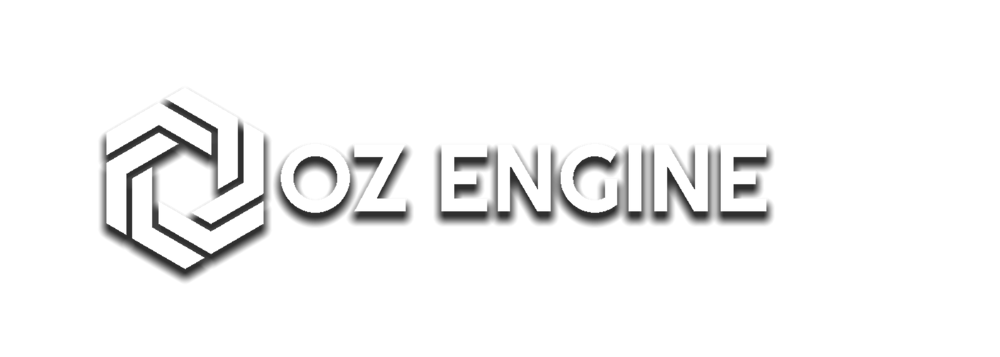

===========================================================================
                               


===========================================================================


# 𝙊𝙯-𝙀𝙣𝙜𝙞𝙣𝙚, 𝙖 **𝙏𝙚𝙭𝙩-𝘽𝙖𝙨𝙚𝙙 𝙀𝙣𝙜𝙞𝙣𝙚** 𝙢𝙖𝙙𝙚 𝙪𝙨𝙞𝙣𝙜 **𝙋𝙮𝙩𝙝𝙤𝙣**.

It can be used to make games in:
* **Terminal**  
* **Discord** 
* [**Microbit**](https://github.com/menitoon/Oz-Engine-Microbit-version)
* Any matrix-led screen


  


## 𝙏𝙚𝙭𝙩 📜

Play in the **console** 

| 0 | 0 | 0 | 0 | 0 |
|---|---|---|---|---|
| 0 | 0 | 0 | 0 | 0 |
| 0 | 0 | 0 | 5 | 0 |   
| 0 | 1 | 2 | 0 | 0 |
| 0 | 0 | 0 | 0 | 0 |

```
00000
00000
00050
01200
00000
```

## 𝙎𝙘𝙧𝙚𝙚𝙣 📺
Or on a **matrix led screen**


## 𝙁𝙚𝙖𝙩𝙪𝙧𝙚𝙨

* Sprites🍄
* Handling Collision 💥
* Calling Groups 📢
* Camera Support 🎥
* Custom Sprite Type 🖌️


## 𝘚𝘵𝘢𝘳𝘵𝘶𝘱 👟

In **CommandLine** type this:

 ``` pip install Oz-Engine ```
 
 Then **import** it at the top of your project like so:
 ```python 
 import OzEngine as oz 
 ```


## 𝙳𝚘𝚌𝚞𝚖𝚎𝚗𝚝𝚊𝚝𝚒𝚘𝚗 📖

If you want to get started and learn how to use it go [here](https://github.com/menitoon/Oz-Engine/wiki).


## 𝘾𝙤𝙣𝙩𝙧𝙞𝙗𝙪𝙩𝙞𝙣𝙜 💻

Contributions to this project are greatly apreciated 😁 for more info ℹ️
check the [Contribution Guidelines](https://github.com/menitoon/Oz-Engine/blob/main/CONTRIBUTING.md), there's a also a deep explanation on how the engine works.

__If you want to support me and the project please consider leaving a star ⭐  as it just makes my day better !__
