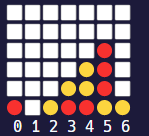

===========================================================================
                               


===========================================================================


# Oz-Engine, a **Text-Based Engine** made using **Python**.
It can be used to make games in:
* **Terminal**  
* **Discord** 
* [**microbit**](https://github.com/menitoon/Oz-Engine-Microbit-version)
* any matrix-led screen

  

### STARTUP 👟

In **CommandLine** type this:

 ``` pip install Oz-Engine ```
 
 Then **import** it at the top of your project like so:
 ```python 
 import OzEngine as oz 
 ```


## How to use it 🤔

```diff 
- ⚠️ NOTE :  before reading this remind yourself that: 
- Some explanations might be unclear or wrong if so then please report them so it can changed.
- Also The pip package might not be updated yet since it's managed by @Splatcraft2404.
```

### Creating the canvas ⬜

Start by instancing a canvas like so: 
```python 
canvas = oz.Canvas("#") 
# The  argument is given what the canvas will be filled with.
```
and then instancing a camera so that we can render the scene.
```python
camera = oz.Camera(canvas , [10 , 10] , [0 , 0] , "camera")
#First argument is the canvas that it belongs to.
#Second argument is the size of the camera.
#Thid argument is the position of the camera.
#And the last one is the name.
```


Now try rendering it:
```python
print(camera.render())
```
You should see a square filled with "#"

## Adding Sprites 🍄

It's cool and all but a little boring to have just an empty canvas.
Let's add a sprite:
```python
sprite = oz.Sprite(canvas , "S" , [3 , 3] , "first_sprite" ) 
# "canvas" is the canvas that is associated with the sprite in question
# "S" is character that the sprite will be represented with.
# and "first_sprite" is the name of the sprite
```
feel free to add multiples sprites :) !

## Moving functions 🏃

If you wanted to move them then simply do that:
```python

# add 1 to x-axis:
sprite.change_x(1) 

# add -1 y-axis:
sprite.change_y(-1)

#set x-axis
sprite.set_x(1)

#set y-axis
sprite.set_y(3)

#set position (x and y)
sprite.set_position([3 , 5])

#add to x and y axis
sprite.change_postion(1 , -1)
#first argument is for "x" and the second for "y"

```

## Useful sprite methods 🎓

There are a few important function for sprites that needs to be known.
For example if you want to delete 💣 an object 
```python
albert_the_sprite.destroy()
```

or to rename it
```python
albert_the_sprite.rename("albert")
```

but also to handle collisions 💥
```python
albert_the_sprite.get_colliding_objects()
```
"get_colliding_objects" is a method that returns all sprites names that colliding with the sprite that execute
the method (albert_the_sprite here)

we can check collision like so:
```python

canvas = oz.Canvas("#")

albert_the_sprite = oz.Sprite(canvas , "a" , [0 , 0] , "albert")
robert_the_sprite = oz.Sprite(canvas , "r" , [0 , 0] , "robert")
billy_the_sprite = oz.Sprite(canvas, "b" , [2 , 0] , "billy")

if "robert" in albert_the_sprite.get_colliding_objects():
  
  print("collides with:" , albert_the_sprite.get_colliding_objects())
  print("robert collided with albert.")

else:

  print("robert didn't collide with albert.")
```

Now if we wanted to execute a method to robert with could use the "get_sprite()"
``` python
canvas.get_sprite("robert").set_position([2 , 0])
```
Please note that you will need to execute this method throught the canvas that is associated with the sprite.

## Groups

"group" is an optional argument of the object "Sprite" that can be used to call a method to each sprite that belong to this group or check collisions between groups.

### Collision with groups 💥

First things first you need to actually define the group that the sprite belongs to:
```python
snake_the_sprite = oz.Sprite(canvas , "s" , [0 , 0] , "albert" , "animal")
cat_the_sprite = oz.Sprite(canvas , "c" , [0 , 0] , "robert" , "animal")

apple_the_sprite = oz.Sprite(canvas , "a" , [0 , 0] , "robert" , "fruit")
```

now we can simply check collision:
```python
print(apple_the_sprite.get_colliding_groups())
#output : ["fruit" , "animal"]


if "animal" in apple_the_sprite.get_colliding_groups():
    print("The fruit was eaten by an animal ")

else:
    print("The fruit is still here :D !")
```

the method "get_colliding_groups()" returns a list that contains every groups that collides with the sprite
that executes the method.

## Calling groups 📢

Let's imagine that we are making a game where if a button is pressed all the doors should open
well it would simple just to use the method "call_group()".

but first we need to create our own sprite type : "Door"
we will do so by creating a New class called you guessed it : "Door"

```python

#inherits from class "Sprite"
class Door(Sprite):
  #reusing code from Sprite here:
  #if you want to know what this is for then go to the "How it works" section.
  
  __slots__ = "canvas_owner", "char", "position", "name", "group", "distance", 
  "on_function_ready"

  def __init__(self,
               canvas_owner: object,
               char: str,
               position: list,
               name: str,
               group=None,  
               ):

    
    self.char = char
    self.position = position
    self.name = name
    self.canvas_owner = canvas_owner
    self.group = group

    if name in canvas_owner.sprite_names:
      # change name if already taken
      self.name = name + f"@{str(id(self))}"

    # register infos in "canvas_owner" :
    canvas_owner.sprite_tree.append(self)
    canvas_owner.sprite_names.append(self.name)
    canvas_owner.sprite_names_dict[self.name] = self
    canvas_owner.sprite_position_dict[self] = position

    if not (group in canvas_owner.sprite_group_dict):
      #if group is new then add to "group_tree" and create new key 
      #location for "sprite_group_dict".
      canvas_owner.sprite_group_dict[group] = []
      canvas_owner.group_tree.append(group)

                 
    canvas_owner.sprite_group_dict[group].append(self)


  #our function to open the door
  def open_door(self):
    print(f'door : "{self.name}" was opened !' )

```
and then we can instance the door and call the method
```python
canvas = oz.Canvas("#")

door_one = Door(canvas , "1" , [-4 , 2] , "door_one" , "door")
door_two = Door(canvas , "2" , [2 , -3] , "door_two" , "door")
door_three = Door(canvas , "3" , [3 , 7] , "door_three" , "door")

canvas.call_group("door" , "open_door" )

#output : 
#door : "door_one" was opened !
#door : "door_two" was opened !
#door : door_three was opened !

```

but now let's say we want to give and argument well it's super easy :) 
```python
#add method to the door class
def multiply_x_axis(self , times):
    self.set_x(self.position[0] * times) #position[0] is the x-axis
```

then just call the method:
```python
canvas = oz.Canvas("#")

door_one = Door(canvas , "1" , [-4 , 2] , "door_one" , "door")
door_two = Door(canvas , "2" , [2 , -3] , "door_two" , "door")
door_three = Door(canvas , "3" , [3 , 7] , "door_three" , "door")

print(canvas.sprite_position_dict.values()) #prints all positions
#output before call : dict_values([[-4, 2], [2, -3], [3, 7]])

canvas.call_group("door" , "multiply_x_axis", 2 )
print(canvas.sprite_position_dict.values()) #prints all positions multiplied by 2
#output after call : dict_values([[-4, 2], [2, -3], [3, 7]])
```

giving multiple arguments is possible.

# Making a Game : __**Connect-4**__

Power-4 is a classic game that can be easily made with __**Oz-Engine**__

_(Snake 🐍 is also possible if you possess a microbit card go [here](https://github.com/menitoon/Oz-Engine-Microbit-version) if you are interested._) 


## Explaining How the **Gameloop** is structured

Here I will be explain ``game`` function and then I'l explain how functions it uses are working.
````python
def game():

  #make these accessibles through any functions
  global canvas
  global coin_red_position
  global coin_yellow_position
  global coin_level

  #Instance "canvas"
  canvas = oz.Canvas("██")
  #Instance "camera"
  camera = oz.Camera(canvas, [7, 6], [0, 0], "cam")

  coin_level = [5 for i in range(camera.size[0])]*
  #Contains every positions of red coins
  coin_red_position = []
  #Contains every positions of yellow coins
  coin_yellow_position = []

  #Tell who's playing
  is_turn_p_one = True
  #render
  print(camera.render())
  #Print the list of valid inputs
  print( " " + (" ".join(get_possible_input())))

  while True:

    action = input(": ") #ask input

    if action in get_possible_input(): #if action token is possible
    
      place_coin(int(action), "🔴" if is_turn_p_one else "🟡") #place "🔴" if red's                                                                 #turn else place"🟡"
      is_turn_p_one = not is_turn_p_one
      is_aligned = check_aligned()    #Tells if 4 coins of the same color are aligned


      if is_aligned[0]: #if is_aligned[0] == True

        break
    
    os.system('cls')        #clears the screen
    print(camera.render())  #render
    print( " " + (" ".join(get_possible_input()))) #print possible inputs

  #End game script :
  os.system('cls') #clear screen
  print(camera.render()) #render
  print(f"Aligned ! {is_aligned[1]} won !") #print win message
  #ask if you want to do a knew a game
  if input("Would you like to play an other round ?(y/n): ") == "y": #if input given is "y" 
    game()                                                           #then restart game by calling "game()"
    
  else:
    exit() #quit
````
```coin_level``` is a list with every high of every **column** the lower that high is the higher the coins are.

## Creating the **Coin** class 🟡

To be able to have more control over our sprites we will create the **Coin** class

````python
class Coin(oz.Sprite):

  __slots__ = "canvas_owner", "char", "position", "name", "group", "distance",
  "on_function_ready"

  def __init__(
    self,
    canvas_owner: object,
    char: str,
    position: list,
    name: str,
    group=None,
  ):
    '''Character that represents the sprite when rendered.'''
    self.char = char
    '''List that has two element "x" and "y" it tells where to render the sprite.'''
    self.position = position
    '''Name of the sprite that can be used to get reference from it using the "get_sprite" method throught a "Canvas" object.'''
    self.name = name
    '''Canvas that the sprite is associated to.'''
    self.canvas_owner = canvas_owner
    '''group is a string that be used to call a method on each sprite that has the same method with 
    the method "call_group" through the canvas and it can also be used to check collision by seing which sprite of which
    group is colliding with our sprite with the method "get_colliding_groups" that can be executed by a "Sprite" object. '''
    self.group = group

    if name in canvas_owner.sprite_names:
      # change name if already taken
      self.name = name + f"@{str(id(self))}"

    # register infos in "canvas_owner" :
    canvas_owner.sprite_tree.append(self)
    canvas_owner.sprite_names.append(self.name)
    canvas_owner.sprite_names_dict[self.name] = self
    canvas_owner.sprite_position_dict[self] = position

    if not (group in canvas_owner.sprite_group_dict):
      #if group is new then add to "group_tree" and create new key
      #location for "sprite_group_dict".
      canvas_owner.sprite_group_dict[group] = []
      canvas_owner.group_tree.append(group)

    canvas_owner.sprite_group_dict[group].append(self)

    if self.char == "🟡":
      coin_yellow_position.append(self.position)
    else:
      coin_red_position.append(self.position)
````
Here we created a custom **Sprite** class like we did [here](#calling-groups)

## Placing down a coin
Let's create a function to place down some coins.
````python
def place_coin(x, val):

  coin = Coin(canvas, val, [x, coin_level[x]], "coin")
  coin_level[x] -= 1 #so that the next coin at this column will go up

````
**x** represents the column where we place our coin and **val** whethever it's a **red** one 🔴 or a **yellow** one 🟡

## Giving valid inputs
The two players needs to know in which column they can place a coin, so let's make a function to do this:
```python
def get_possible_input():

  return [str(c) for c in range(len(coin_level)) if not (coin_level[c] == -1)] 
````
we return a list of all column that aren't full, we also use **str()** to later on have more control over
what we print to the player.

## detecting if coins are aligned

```python
def check_aligned():


  has_alignement = (False , "None") # if someone won or not
  
  # check if red are aligned
  for red_coin_pos in coin_red_position:

    horizontal_match = 0
    vertical_match = 0
    diagonal_left_match = 0
    diagonal_right_match = 0

    POS_X = red_coin_pos[0]
    POS_Y = red_coin_pos[1]

    # horizontal_match check
    
    for i in range(1, 4):
      if [i + POS_X ,POS_Y] in coin_red_position: # if are aligned add 1 to horizontal_match 
        horizontal_match += 1
        

      else:
        break

    # to get a win you need at least 3 matches
    # we break if someone won 
    if horizontal_match == 3:
      has_alignement = (True , "red")
      break

    #we do same for others directions

    # vertical_match check
    for i in range(1, 4):
      if [POS_X, i + POS_Y] in coin_red_position:
        vertical_match += 1

      else:
        break

    if vertical_match == 3:
      has_alignement = (True , "red")
      break

    
    # diagonal_left_match check
    for i in range(1, 4):
      if [-i + POS_X, -i + POS_Y] in coin_red_position:
        diagonal_left_match += 1

      else:
        break

    if diagonal_left_match == 3:
      has_alignement = (True , "red")
      break

    # diagonal_right_match check
    for i in range(1, 4):
      if [i + POS_X, -i + POS_Y] in coin_red_position:
        diagonal_right_match += 1

      else:
        break

    if diagonal_right_match == 3:
      has_alignement = (True , "red")
      break
  
  if has_alignement[1] != "None":
    return has_alignement

  #we do the same for yellow coins
  
  for yellow_coin_pos in coin_yellow_position:

    POS_X = yellow_coin_pos[0]
    POS_Y = yellow_coin_pos[1]

    horizontal_match = 0
    vertical_match = 0
    diagonal_left_match = 0
    diagonal_right_match = 0

    # horizontal_match check
    for i in range(1, 4):
      if [i + POS_X ,POS_Y] in coin_yellow_position:
        horizontal_match += 1

      else:
        break

    if horizontal_match == 3:
      has_alignement = True
      break


    # vertical_match check
    for i in range(1, 4):
      if [POS_X, i + POS_Y] in coin_yellow_position:
        vertical_match += 1

      else:
        break

    if vertical_match == 3:
      has_alignement = (True , "yellow")
      break

    
    # diagonal_left_match check
    for i in range(1, 4):
      if [-i + POS_X, -i + POS_Y] in coin_yellow_position:
        diagonal_left_match += 1

      else:
        break

    if diagonal_left_match == 3:
      has_alignement = (True , "yellow")
      break

    # diagonal_right_match check
    for i in range(1, 4):
      if [i + POS_X, -i + POS_Y] in coin_p_two_position:
        diagonal_right_match += 1

      else:
        break

    if diagonal_right_match == 3:
      has_alignement = (True , "yellow")
      break

  return has_alignement
```


## Executing the **game** 🕹️

Just execute the ```game()``` function at the end of your script, save it and close it.
Now just double click on the ``main.py`` file to run it.

And we have a working Connect-4 game 😊.

_if you have any issue you can find the full code [here](https://github.com/menitoon/Connect-4-with-Oz-Engine)
# How it works 🌟


To start simple imagine we have a board that is filled with "0"


this board can be represented with a 2D-list:
```python
[  
   [0, 0 , 0 , 0, 0],
   [0, 0 , 0 , 0, 0],
   [0, 0 , 0 , 0, 0],
   [0, 0 , 0 , 0, 0],
                       ]
```

and that what the method "clear_canvas" from the "Camera" class makes for you:

``` python
def clear_canvas(self):
    """
    returns a clean canvas, setted
    in to it's empty state
    """

    SIZE_X = self.size[0]
    SIZE_Y = self.size[1]

    line = [self.canvas_owner.VOID for _ in range(SIZE_X)] #creates a list containing the 
                                                           #argument "VOID" 
                                                           #it would give : '[ 0 , 0 , 0 , 0 , 0]'  if SIZE_X = 5 and VOID = 0)

    clear_canvas = [line.copy() for _ in range(SIZE_Y)]    #appends multiple  copies(so we can edit it) of line 
    return clear_canvas                                    #the amount of copies appended depends on the value "SIZE_Y"
    #and we return "clear_canvas".
```

and we should get what we had at first using this function.

## Editing the canvas

Let's bring some life to this empty canvas by using the method "edit_element"

```python

  def edit_element(self, canvas, x, y, char):
    """
    allows to edit an element of a canvas
    """
    # "canvas" is the canvas we want to edit (you'l see later that we always the same one)
    # "y" is the line we want to edit
    # "x" is the element in the line want to edit.
    # and "char" is the character that we replace by the old one.

    (canvas[y])[x] = char 

```

# Classes 

There are 3 Classes In Oz-Engine :

⬤ **Canvas**

⬤ **Sprite**

⬤ **Camera**

## Canvas

Canvas object can be used to store sprite informations
It has one parameter "VOID" which what empty cells look like.

Here is an example :
```python

canvas_fruit = oz.Canvas("o") # "VOID" here is "o"

apple = oz.Sprite(canvas_fruit , "🍎" , [0 , 0] , "apple")
banana = oz.Sprite(canvas_fruit , "🍌" , [1 , 0] , "banana")


canvas_vehicles = oz.Canvas("#")

car = oz.Sprite(canvas_fruit , "🚗" , [0 , 0] , "car")
plane = oz.Sprite(canvas_fruit , "✈" , [1 , 0] , "plane")
```

Here "canvas_fruit" does only contain information about "apple" and "banana"
And "canvas_vehicles" contain information about "copybook" and "notebook"


# Methods

## \_\_init\_\_

Nothing particular here just setting up
the given parameters and instantiating variable that are needed.

```python
 def __init__(self, VOID):
    ''' Characters that fills the canvas when nothing is rendered on a tile. '''
    self.VOID = VOID
    '''List that contains every distance of each sprite '''
    self.distance_tree = []
    '''List that contains every reference of each sprite '''
    self.sprite_tree = []
    '''List that contains every groups that exists'''
    self.group_tree = []
    '''List that contains every name of each sprite '''
    self.sprite_names = []
    '''Dictionary that has a sprite reference as a key and the corresponding name as a value'''
    self.sprite_names_dict = {}
    '''Dictionary that has a sprite reference as a key and the corresponding position as a value'''
    self.sprite_position_dict = {}
    '''Dictionary that has a sprite reference as a key and the corresponding group as a value'''
    self.sprite_group_dict = {}
```


## get_sprite

The method "get_sprite" allows to get the reference of sprite by it's name.
It works with a dictionnary that stores names as keys a reference as values.

```python
  def get_sprite(self, name):
    """
    returns reference to sprite that owns the given name
    """

    return self.sprite_names_dict[name]
```

## call_group 📢

Allows you to call a "method" to a group
```python
  def call_group(self, group_to_call: str, method_to_call, *args):
    """
    Call a method  to every sprites that belongs to the group that is
    given 

    like so:

    canvas.call_group("group_name_here" , method_is_going_to_be_called_on_them() )
    
    """

    #gets every sprite that is in the group given
    
    sprite_to_call = self.sprite_group_dict.get(group_to_call)
    if sprite_to_call == None:
      #if group given doesn't exist then sumbit error
      raise Exception(
        f'''The group "{group_to_call}" doesn't exist please specify a valid group to call. '''
      )

    for todo_sprite in sprite_to_call:

      #get function of sprite
      func = getattr(todo_sprite, method_to_call)
      #executes it with the argument given
      func(*args)
```

"sprite_group_dict" is dictionnary that holds every sprite reference that is in the given group.

# Sprite 🍄

Sprite objects are used to fill the canvas
they have 5 parameters :

⬤ **canvas_owner**

⬤ **char**

⬤ **position**

⬤ **name**

⬤ **group**


# Methods

## \_\_init\_\_

Here we just set up the variable that were asked in the parameters


```python

 def __init__(
    self,
    canvas_owner: object,
    char: str,
    position: list,
    name: str,
    group=None,
  ):
    '''Character that represents the sprite when rendered.'''
    self.char = char
    '''List that has two element "x" and "y" it tells where to render the sprite.'''
    self.position = position
    '''Name of the sprite that can be used to get reference from it using the "get_sprite" method throught a "Canvas" object.'''
    self.name = name
    '''Canvas that the sprite is associated to.'''
    self.canvas_owner = canvas_owner
    '''group is a string that be used to call a method on each sprite that has the same method with 
    the method "call_group" through the canvas and it can also be used to check collision by seing which sprite of which
    group is colliding with our sprite with the method "get_colliding_groups" that can be executed by a "Sprite" object. '''
    self.group = group

```

and here we register info to the __canvas_owner__.


```python
    
    if name in canvas_owner.sprite_names:
      # change name if already taken
      self.name = name + f"@{str(id(self))}"

    # register infos in "canvas_owner" :
    canvas_owner.sprite_tree.append(self) # register reference
    canvas_owner.sprite_names.append(self.name) # register name
    canvas_owner.sprite_names_dict[self.name] = self # register name as key and reference as value 
    canvas_owner.sprite_position_dict[self] = position # register reference as key and position as value
    
    if not (group in canvas_owner.sprite_group_dict):
      #if group is new then add to "group_tree" and create new key
      #location for "sprite_group_dict".
      canvas_owner.sprite_group_dict[group] = []
      canvas_owner.group_tree.append(group)

    canvas_owner.sprite_group_dict[group].append(self) #add group reference to the group dict
    #it can looks something like that : { "group" : [sprite_reference1 , sprite_reference2 , ect] }

```

## destroy 💣

__destroy__ is used to delete sprite
it just deletes things that we registered earlier in the __\_\_init\_\___

```python
  def destroy(self):

    del self.canvas_owner.sprite_names_dict[self.name]
    del self.canvas_owner.sprite_position_dict[self]

    #remove self from key that contain every sprite in group
    INDEX = self.canvas_owner.sprite_group_dict[self.group].index(self)
    del (self.canvas_owner.sprite_group_dict[self.group])[INDEX]

    self.canvas_owner.sprite_names.remove(self.name)
    self.canvas_owner.sprite_tree.remove(self)

    if len(self.canvas_owner.sprite_group_dict[self.group]) == 0:
      #delete group if no one is in it.
      del self.canvas_owner.sprite_group_dict[self.group]
      self.canvas_owner.group_tree.remove(self.group)

    del self
```

## rename

__rename__ as it name suggest allows to rename sprites
it changes every time the __old__ name was used by the __new__ one given.
```python
 def rename(self, new_name: str):
    """
    allows to change the name of a sprite, to "rename" it.
    """

    del self.canvas_owner.sprite_names_dict[self.name]

    if new_name in self.canvas_owner.sprite_names:
      # change new_name with object id() if name already taken
      new_name = new_name + f"@{str(id(self))}"

    # change name

    INDEX = self.canvas_owner.sprite_names.index(self.name)
    self.canvas_owner.sprite_names[INDEX] = new_name
    self.name = new_name
    self.canvas_owner.sprite_names_dict[new_name] = self
```

## get_colliding_objects 💥

__get_colliding_object__ works by getting the reference of each sprite that is located at the
same __position__ of the sprite that calls the method.

```python
  def get_colliding_objects(self):
    """
    Returns a list of colliding objects(by name)
    """

    object_colliding = [] 

    sprite_check_list = list(
      self.canvas_owner.sprite_position_dict.copy().keys())
    position_check_list = list(
      self.canvas_owner.sprite_position_dict.copy().values())

    sprite_check_list.remove(self)           #remove self reference
    position_check_list.remove(self.position) #remove self position

    for todo_sprite in sprite_check_list:

      POSITION_CHECK = self.canvas_owner.sprite_position_dict[
        todo_sprite]  # gets the position from key

      if self.position in position_check_list: #checks until the no sprites has the same position

        object_colliding.append(
          todo_sprite.name) if POSITION_CHECK == self.position else None
      else:
        break

    return object_colliding
```

It gives back names of the sprite who are colliding with us.

## get_colliding_groups 💥

It works the same as __get_colliding_objects__ except here it gives the group instead of giving back names.
We check if all groups are in __groups_colliding__.

```python
 def get_colliding_groups(self):
    """
    Returns a list of colliding objects(by groups)
    """

    groups_colliding = []

    sprite_check_list = list(
      self.canvas_owner.sprite_position_dict.copy().keys())
    position_check_list = list(
      self.canvas_owner.sprite_position_dict.copy().values())

    sprite_check_list.remove(self)
    position_check_list.remove(self.position)

    for todo_sprite in sprite_check_list:

      POSITION_CHECK = self.canvas_owner.sprite_position_dict[
        todo_sprite]  # gets the position from key

      if self.position in position_check_list and not (set(
          self.canvas_owner.group_tree) == set(groups_colliding)):

        groups_colliding.append(
          todo_sprite.group) if POSITION_CHECK == self.position else None
      else:
        break

    return groups_colliding

```

## update_distance

__update_distance__ is used to well update distance of your sprite
it's used in every __moving__ / __position__ functions
```python
  def update_distance(self):
    """

        update the dictionary : "sprite_position_dict" of "canvas_owner"
        like so :

        sprite_reference :  sprite_position

        """

    # update it
    self.canvas_owner.sprite_position_dict[self] = self.position
```

## position-based methods

I'm not cover how every position-based method works because they are very similar to each other
but here how one of then works:

```python
  def change_position(self, x_val: int = 0, y_val: int = 0):

    self.position[0] += x_val
    self.position[1] += y_val
    self.update_distance()
```

# Camera 🎥

__Camera__ object is used to render __Canvas__ object
it has 4 parameters:

⬤ **canvas_owner**

⬤ **size**

⬤ **position**

⬤ **name**


## \_\_init\_\_

Nothing particular here just setting up variables

```python
def __init__(self, canvas_owner: object, size: list, position: list,
               name: str):
    '''canvas that is associated with. '''
    self.canvas_owner = canvas_owner
    '''size of the camera '''
    self.size = size
    ''' position of the camera '''
    self.position = position
    ''' name of the camera'''
    self.name = name
    ''' define the order of rending sprties '''
    self.sprite_render_priority = []
    ''' dictionnary that contain keys "sprite" for value "distance" '''
    self.sprite_distance_dict = {}

    if size == [0, 0]:

      warn(
        f''' size of camera : "{name}" isn't defined so it will most likely not work.\n please define a valid size.'''
      )
```
## update_sprite_distance

This method is used to update all distances of each sprites
```python

  def update_sprite_distance_dict(self):
    """
        update the distance of every sprite
        """

    self.sprite_distance_dict = {} #creates empty dict

    for todo_sprite in self.canvas_owner.sprite_tree: #we interate through every sprite reference
      sprite_position = [                             #and update the distance for each of them
        todo_sprite.position[0] - self.position[0],
        todo_sprite.position[1] - self.position[1]
      ]
      self.sprite_distance_dict[todo_sprite] = self.get_square_distance_to(
        sprite_position)
```


## edit_element

Is used to replace a char by a new one.

```python
  def edit_element(self, canvas, x, y, char):
    """
    allows to edit an element of a canvas
    """

    #canvas[y] gets the line
    # and then with [x] gets the element
    
    (canvas[y])[x] = char
```

## get_square_distance_to

Gives back the sum of the distance of the four corner of the render canvas
```python
  def get_square_distance_to(self, position: list):
    """
    returns the sum of the distance between the 4 corners of the square
    """

    SIZE_X = self.size[0] - 1  
    SIZE_Y = self.size[1] - 1

    corner_top_left = [0, 0]
    corner_top_right = [SIZE_X, 0]
    corner_bottom_right = [SIZE_X, SIZE_Y]
    corner_bottom_left = [0, SIZE_Y]

    return (math.dist(corner_top_left, position) +
            math.dist(corner_top_right, position) +
            math.dist(corner_bottom_right, position) +
            math.dist(corner_bottom_left, position))
```

## is_renderable

Says whetever a sprite can rendered or not.
```python
  def is_renderable(self, distance):
    """
        returns whether a sprite a renderable from the distance given.
        """

    MAX_DISTANCE = (self.get_square_distance_to([0, 0])) #represents the maximum distance to be rendered

    return not (distance + self.get_square_distance_to(self.position)) > (
      MAX_DISTANCE + self.get_square_distance_to(self.position))
```

## render 

__render__ is the main method of __Camera__ it returns back a string that represents the canvas if the parameter __is_string__ is True else returns a the canvas as a 2D-list
```python
  def render(self, is_string=True):
    """
    Returns the rendered canvas as a string if "is_string" is true else as a          2D-list
    """

    self.update_sprite_distance_dict()
    canvas = self.clear_canvas()

    MAX_DISTANCE = (self.get_square_distance_to([0, 0]))

    distances = list(self.sprite_distance_dict.copy().values())
    sprite_list = list(self.sprite_distance_dict.copy().keys())

    for todo in range(len(self.canvas_owner.sprite_tree)):

      min_distance = min(distances)
      # gets the smallest distance in list "distances"
      is_off_screen = (min_distance + self.get_square_distance_to(
        self.position)) > (MAX_DISTANCE +
                           self.get_square_distance_to(self.position))

      if is_off_screen:
        # if the smallest distance of the sprite(+ camera offset)
        # is bigger than "MAX_DISTANCE"
        break

      #get corresponding sprite reference
      index = distances.index(min_distance)
      sprite = sprite_list[index]
      position_to_render_sprite = [
        sprite.position[0] - self.position[0],
        sprite.position[1] - self.position[1]
      ]

      #edit canvas
      self.edit_element(canvas, position_to_render_sprite[0],
                        position_to_render_sprite[1], sprite.char)

      # remove thoses
      del sprite_list[index]
      del distances[index]

    if is_string == True:

      canvas = ["".join(canvas[line]) for line in range(len(canvas))]

      for element in range(len(canvas) - 1):

        canvas[0] += "\n" + canvas[element + 1]
      canvas = canvas[0]

    return canvas
```
