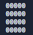

=======================================================================================
# OZ ENGINE 

Oz-Engine is a text based engine made by @menitoon using python.
It can be used to make games in terminal and with additional modules in discord or any matrix led based screen

#### STARTUP

 ``` pip install Oz-Engine ```
 
 ` import OzEngine as oz `


# How to use it

## Creating the canvas

Start by instancing a canvas like so: 
```python 
canvas = Canvas([10, 10] , "#") # The first argument is the size of canvas
                                # The second argument is what the canvas will be filled with.
```
Now try rendering it:
```python
print(canvas.get_canvas())
```
You should see a square filled with "#"

## Adding Sprites

It's cool and all but a little boring to have just an empty canvas.
Let's add a sprite:
```python
sprite = Sprite(canvas , "S" , [3 , 3] , "first_sprite" ) 
# "canvas" is the canvas that is associated with the sprite in question
# "S" is character that the sprite will be represented with.
# and "first_sprite" is the name of the sprite
```
feel free to add multiples sprites :) !

If you wanted to move them then simply do that:
```python

# add 1 to x-axis:
sprite.position[0] += 1

# add -1 y-axis:
sprite.position[1] -= 1

# render screen:
print(canvas.get_canvas())
```

## Useful sprite methods

There are a few important function for sprites that needs to be known.
For example if you want to delete an object
```python
albert_the_sprite.destroy()
```

or to rename it
```python
albert_the_sprite.rename("albert")
```

but also to handle collisions
```python
albert_the_sprite.get_colliding_objects()
```
"get_colliding_objects" is a method that returns all sprites names that colliding with the sprite that execute
the method (albert_the_sprite here)

we can check collision like so:
```python

canvas = Canvas([4 , 5] , 0)

albert_the_sprite = Sprite(canvas , "a" , [0 , 0] , "albert")
robert_the_sprite = Sprite(canvas , "r" , [0 , 0] , "robert")
billy_the_sprite = Sprite(canvas, "b" , [2 , 0] , "billy")

if "robert" in albert_the_sprite.get_colliding_objects():
  
  print("collides with:" , albert_the_sprite.get_colliding_objects())
  print("robert collided with albert.")

else:

  print("robert didn't collide with albert.")
```

Now if we wanted to execute a method to robert with could use the "get_sprite()"
``` python
canvas.get_sprite("robert").position = [2 , 0]
```
Please note that you will need to execute this method throught the canvas that is associated with the sprite.

# How it works

To start simple imagine we have a board that is filled with "0"



this board can be represented with an 2D-array:
```python
[  
   [0, 0 , 0 , 0, 0],
   [0, 0 , 0 , 0, 0],
   [0, 0 , 0 , 0, 0],
   [0, 0 , 0 , 0, 0],
                       ]
```

and that what the function "create_canvas" creates for you:
``` python
 def create_canvas(self):

    #self is the canvas in question
    #so all variable that has "self" belongs to the canvas
   
    # allow to define size of canvas

    SIZE = self.SIZE    # "SIZE" is the argument you passed at first
    SIZE_X = self.SIZE_X # "SIZE_X" is the x-axis of SIZE
    SIZE_Y = self.SIZE_Y # "SIZE_Y" is the y-axis of SIZE
    VOID = self.VOID     # and VOID is what the canvas is filled with

    if SIZE == [0, 0]:   #warning here if "SIZE" is invalid
      warn("Canvas size is not defined and will most likely not work.")

    x_line = [] #we start by making a list that contain as much as SIZE_X 

    for todo in range(SIZE_X):
      x_line.append(str(VOID))

    #and then we append the list "x_line" to the canvas
   
    for subtodo in range(SIZE_Y):
      self.canvas.append(x_line.copy())


```

and we should get what we had at first using this function.
